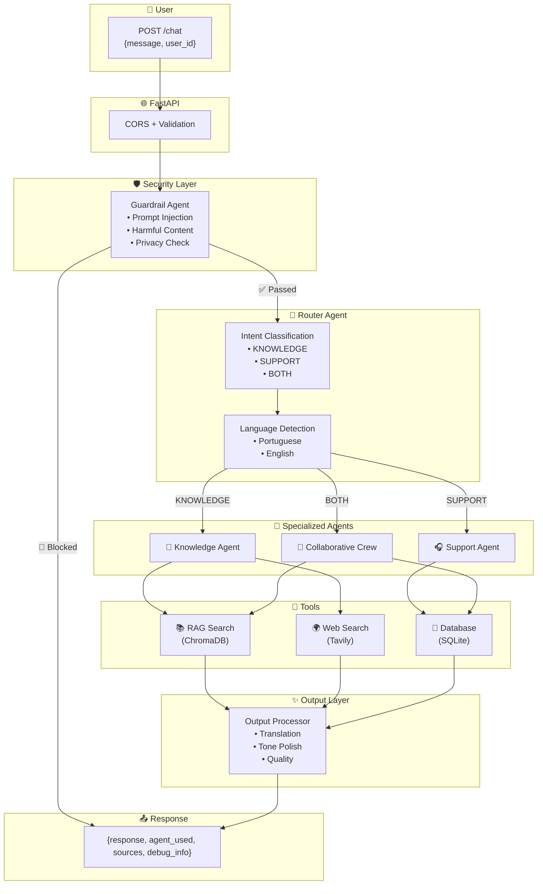
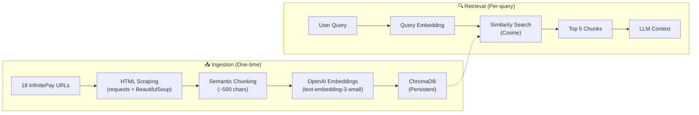

# CloudWalk Agent Swarm 🤖

> **Multi-agent AI system for customer support and intelligent knowledge retrieval** — Built for InfinitePay

[](https://www.python.org/downloads/)
[](https://fastapi.tiangolo.com/)
[](https://docs.crewai.com/)
[](https://www.docker.com/)

---

## 📋 Table of Contents

- [Overview](#-overview)
- [Live Demo](#-live-demo)
- [System Architecture](#-system-architecture)
- [Agents](#-agents)
- [RAG Pipeline](#-rag-pipeline)
- [Quick Start](#-quick-start)
- [API Reference](#-api-reference)
- [Testing](#-testing)
- [Development with AI-Assisted Tools](#-development-with-ai-assisted-tools)
- [Design Decisions](#-design-decisions)
- [Project Structure](#-project-structure)

---

## 🎯 Overview

This project implements an **intelligent Agent Swarm** that processes user queries through multiple specialized AI agents working collaboratively:

| Agent | Role | Tools |
|-------|------|-------|
| 🔀 **Router** | Intent classification & language detection | LLM (few-shot) |
| 🧠 **Knowledge** | Product info & general knowledge | RAG, Web Search |
| 🎧 **Support** | Customer account & transactions | SQLite Database |
| ✨ **Output Processor** | Translation & quality polish | LLM |
| 🛡️ **Guardrail** | Security & content filtering | Rule-based + LLM |

### ✅ Key Features

- **RAG Pipeline** — 18 InfinitePay URLs indexed with semantic chunking
- **Web Search** — Real-time information via Tavily API
- **Multi-Agent Collaboration** — Parallel execution for complex queries
- **Bilingual Support** — Portuguese & English with auto-detection
- **Security Guardrails** — Blocks prompt injection, harmful content, privacy violations
- **Modern Frontend** — Chat interface with agent visualization & debug mode
- **Docker Ready** — One-command deployment

---

## 🎬 Live Demo

> Access the frontend at `http://localhost:8080` after starting the server

**Example Interactions:**

| Query | Agent(s) | Response |
|-------|----------|----------|
| "Quais as taxas da maquininha?" | 🧠 Knowledge | Fees from RAG (InfinitePay docs) |
| "Show my balance" | 🎧 Support | User account data from DB |
| "What product is best for me?" | 🧠+🎧 Both | Personalized recommendation |
| "Latest news about AI" | 🧠 Knowledge | Real-time web search results |

---

## 🏗️ System Architecture



### Data Flow

1. **Request** → User sends message via `POST /chat`
2. **Security** → Guardrail Agent validates for threats
3. **Routing** → Router classifies intent + detects language
4. **Execution** → Specialized agent(s) process query
5. **Polish** → Output Processor ensures quality & translation
6. **Response** → JSON with text, agents used, sources, debug info

---

## 🤖 Agents

### 🔀 Router Agent

**File:** `src/agents/router_agent.py`

| Aspect | Details |
|--------|---------|
| **Purpose** | Entry point — classifies queries and detects language |
| **Method** | LLM few-shot classification (gpt-4o-mini, temp=0) |
| **Output** | `(KNOWLEDGE\|SUPPORT\|BOTH, Portuguese\|English)` |

**Why combined routing + language?**
- Single LLM call = lower latency
- RAG content is in Portuguese → explicit detection prevents wrong-language responses

```python
# Example
routing, language = router.classify_query("What are the fees?")
# → ("KNOWLEDGE", "English")
```

**Workflow Orchestration:**  
The Router manages the entire request lifecycle:
1. **Analyzes** incoming messages (intent + language)
2. **Routes** to appropriate agent(s) (KNOWLEDGE, SUPPORT, or BOTH via Collaborative Crew)
3. **Coordinates** parallel execution when needed (ThreadPoolExecutor for BOTH queries)
4. **Ensures** all responses pass through Output Processor for quality control

This direct function call approach provides clean orchestration with excellent performance and debuggability.

---

### 🧠 Knowledge Agent

**File:** `src/agents/knowledge_agent.py`

| Aspect | Details |
|--------|---------|
| **Purpose** | Answers product & general knowledge questions |
| **Tools** | `search_infinitepay_knowledge` (RAG), `search_web` (Tavily) |
| **Priority** | RAG first for InfinitePay topics, Web for general/news |

**Tool Selection Logic:**
- "Taxas da maquininha?" → RAG (InfinitePay product)
- "Latest Palmeiras game?" → Web Search (current events)
- "InfinitePay vs competitors?" → RAG + Web (comparison)

---

### 🎧 Support Agent

**File:** `src/agents/support_agent.py`

| Aspect | Details |
|--------|---------|
| **Purpose** | Customer support with account data access |
| **Tools** | `get_user_info`, `get_user_transactions`, `get_user_cards` |
| **Security** | Hardened against user ID spoofing |

**Available Data:**
- Account status (active/blocked + reason)
- Transaction history (last 5, with failure reasons)
- Card limits and usage

---

### ✨ Output Processor

**File:** `src/agents/output_processor.py`

| Aspect | Details |
|--------|---------|
| **Purpose** | Final response polishing |
| **Tasks** | Translation, tone consistency, ID removal |
| **Critical** | Ensures response language matches query language |

**Example Transformation:**
```
Query (EN): "What are the fees?"
RAG Response (PT): "As taxas são 1.37% para débito..."
Output (EN): "The fees are 1.37% for debit..."
```

---

### 🛡️ Guardrail Agent

**File:** `src/agents/guardrail_agent.py`

| Threat | Detection | Response |
|--------|-----------|----------|
| Prompt Injection | Pattern + LLM | 🚫 Blocked |
| Harmful Content | LLM classification | 🚫 Blocked |
| Privacy Violation | User ID mismatch | 🚫 Blocked |

---

## 📚 RAG Pipeline



### Pipeline Details

#### 1. Data Ingestion (`src/rag/ingest.py`)

**Process:**
1. **Web Scraping** - Fetches HTML from 18 InfinitePay URLs using Playwright
2. **HTML → Markdown** - Converts to clean text format
3. **Semantic Chunking** - Splits text based on HTML structure (preserves topic boundaries)
4. **Embedding Generation** - OpenAI `text-embedding-3-small` (1536 dimensions)
5. **ChromaDB Storage** - Persistent vector database (`data/chromadb/`)

**Semantic Chunking Strategy:**
- **HTML Tag-Based Splitting** - Respects `<h2>`, `<h3>`, `<p>`, `<li>` boundaries
- **Context Preservation** - Keeps related content together (e.g., product features under same heading)
- **Optimal Size** - ~500 characters per chunk (balances context vs. retrieval precision)
- **Metadata** - Stores source URL, chunk index, heading hierarchy

**Why HTML-based chunking?**  
Fixed-size chunking (e.g., every 500 chars) can split mid-sentence or separate related content. HTML structure naturally segments by topic, resulting in more semantically coherent chunks for retrieval.

#### 2. Query-Time Retrieval (`src/rag/search.py`)

**Process:**
1. User query → Embed using same model (`text-embedding-3-small`)
2. Similarity search in ChromaDB (cosine distance, top_k=5)
3. Retrieve chunks with metadata (source URLs, headings)
4. Assemble context for LLM generation

**Retrieval Optimizations:**
- **Increased Top-K** - Boosted from 3 to 5 chunks for better coverage
- **Query Refinement** - Knowledge Agent strips personal context ("my balance" → "product price")
- **Intent-Based Search** - Identifies core information need (e.g., "Can I afford X?" → searches for price)

### Indexed URLs (18 pages)

| Category | URLs |
|----------|------|
| **Core** | `infinitepay.io`, `infinitepay.io/taxas` ⭐ |
| **Hardware** | `/maquininha`, `/maquininha-celular`, `/tap-to-pay`, `/pdv` |
| **Payments** | `/receba-na-hora`, `/link-de-pagamento`, `/boleto`, `/pix`, `/pix-parcelado` |
| **Banking** | `/conta-digital`, `/cartao`, `/rendimento`, `/emprestimo` |
| **Business** | `/gestao-de-cobranca`, `/loja-online`, `/confere` |

### Key Files

| File | Purpose |
|------|---------|
| `src/rag/ingest.py` | URL scraping, chunking, embedding |
| `src/rag/search.py` | Similarity search interface |
| `src/rag/urls.py` | URL list configuration |
| `src/rag/semantic_chunker.py` | Intelligent text splitting |

---

## 🚀 Quick Start

### Prerequisites

- **Docker** & Docker Compose
- **OpenAI API Key** (required) - Get from [platform.openai.com](https://platform.openai.com/api-keys)
- **Tavily API Key** (optional, for web search) - Get from [tavily.com](https://tavily.com)

### Environment Configuration

**Critical First Step:** Configure your API keys before starting.

```bash
# 1. Create environment file
cp .env.example .env

# 2. Edit .env and add your keys
OPENAI_API_KEY=sk-...           # Required
TAVILY_API_KEY=tvly-...         # Optional (enables web search)
ENVIRONMENT=development
LOG_LEVEL=INFO
```

### Running with Docker

```bash
# 1. Clone and enter directory
git clone <repo-url>
cd cloudwalk-agent-swarm

# 2. Start (builds + runs)
docker-compose up --build

# 3. Access
# 🖥️  Frontend: http://localhost:8080
# 📖  API Docs: http://localhost:8080/docs
```

---

## 📡 API Reference

### `POST /chat`

Send a message to the Agent Swarm.

**Request:**
```json
{
  "message": "What are the fees for the Smart machine?",
  "user_id": "client789"
}
```

**Response:**
```json
{
  "response": "The InfinitePay Smart has fees starting from 0.75%...",
  "agent_used": ["knowledge"],
  "sources": ["https://www.infinitepay.io/taxas"],
  "debug_info": {
    "routing": "KNOWLEDGE",
    "language": "English",
    "guardrail": "Passed",
    "total_time_ms": 4523,
    "logs": [...]
  }
}
```

### `POST /users`

Create a new user in the database.

**Request:**
```json
{
  "name": "João Silva",
  "user_id": "joao123"  // Optional, auto-generated if omitted
}
```

### `GET /health`

Health check endpoint.

**Response:**
```json
{
  "status": "healthy",
  "environment": "development",
  "service": "CloudWalk Agent Swarm"
}
```

### Swagger UI

Interactive API documentation: `http://localhost:8080/docs`

---

## 🧪 Testing

The project employs a dual-validation strategy to ensure both code integrity and AI quality.

### 1. Code Integrity (System Tests)
Validates the internal logic of database connections, router classification, and API endpoints.

```bash
# Run the pytest suite (covers DB, Utils, Router functionality)
docker-compose exec agent-swarm pytest
```

**Test Suite Coverage (30 Tests):**

- **API Tests** (`test_api.py` - 4 tests): Health endpoint, chat endpoint validation
- **Collaboration Tests** (`test_collaboration.py` - 8 tests): Multi-agent orchestration, context sharing, router hybrid approach
- **Database Tests** (`test_database.py` - 7 tests): SQLite operations, user data retrieval, support tools
- **RAG Tests** (`test_rag.py` - 5 tests): ChromaDB integration, embedding search, document retrieval
- **Router Tests** (`test_router.py` - 6 tests): Query classification (KNOWLEDGE/SUPPORT/BOTH), routing logic

All tests validate core system functionality without requiring expensive LLM calls for most unit tests.

### 2. AI Quality & Scenarios (Deep Evaluation)
A comprehensive script that runs **40+ real-world scenarios** against the running API to validate RAG accuracy, multi-agent collaboration, and security guardrails.

```bash
# Run the comprehensive evaluation
python scripts/comprehensive_test.py
```

This script generates a detailed Markdown report (e.g., `comprehensive_test_report_20260118.md`) covering:
- ✅ **RAG Accuracy** (Fees, Products)
- 🌍 **Web Search** (News, General Info)
- 👤 **Support Actions** (Transactions, Blocking)
- 🤝 **Collaboration** (Mixed Intent Queries)
- 🛡️ **Security Guardrails** (Prompt Injection Attacks)

### Performance Benchmarks

| Agent Type | Avg. Response Time |
|------------|-------------------|
| Knowledge (RAG) | ~13s |
| Support (DB) | ~8s |
| Collaborative | ~18s |

### 3. Comprehensive Testing Strategy

**Current Approach:**
The dual-layer validation (unit tests + integration scenarios) provides immediate quality feedback during development.

**Future Enhancements:**

#### LLM-as-Judge Evaluation
Implement automated quality assessment:
- **Accuracy Agent** - Validates factual correctness against ground truth
- **Relevance Scoring** - Measures answer pertinence to query
- **Completeness Check** - Ensures all query aspects addressed
- **Metrics Tracking** - Records quality trends over time

#### Continuous Evaluation Pipeline
```
Git Commit → Unit Tests → Integration Tests → LLM Judge → Deploy
                ↓ Fail at any stage = Block merge
```

#### Scenario Expansion
- **Golden Dataset** - Curated set of expected responses
- **Regression Detection** - Alert on quality degradation
- **A/B Prompt Testing** - Compare agent instruction variants

This approach would enable data-driven prompt optimization and ensure consistent AI quality in production.


---

## 🛠️ Development with AI-Assisted Tools

This project leverages cutting-edge LLM tools for rapid, high-quality development:

### **Antigravity** (Google)
Primary development environment used for:
- **Architecture Design** — Multi-agent system planning and workflow orchestration
- **Prompt Engineering** — Iterative refinement of agent instructions (hardening Support Agent to prevent hallucination, adding logical comparison rules to Output Processor)
- **Debugging** — Analyzing CrewAI behavior, fixing context propagation issues (`contextvars` in parallel execution)
- **Test Creation** — Writing comprehensive pytest suites and scenario validation

### **GPT Agent** (OpenAI)
Used for research and analysis:
- **Scenario Generation** — Creating realistic test cases (40+ scenarios in `comprehensive_test.py`)
- **Edge Case Identification** — Security testing (prompt injection patterns, privacy violations)

**Critical Quality Control:**
- ✅ AI-generated code manually reviewed
- ✅ Comprehensive testing (30 unit tests + 40+ integration scenarios)
- ✅ Real-world validation with actual InfinitePay data

---

## 🎨 Design Decisions

### Why CrewAI?

- Native multi-agent orchestration
- Built-in context sharing between tasks
- Clean integration with LangChain tools
- Declarative agent definitions

### Why ChromaDB?

- Local vector store (no external service)
- Persistent storage across restarts
- Simple Python API
- Easy to Dockerize

### Why Tavily for Web Search?

- Structured results optimized for LLMs
- Fast and reliable
- Better than DuckDuckGo for current events

### Collaborative Architecture

For questions requiring both product knowledge AND user data:
- **Parallel Execution** — ThreadPoolExecutor runs agents concurrently
- **Context Synthesis** — Results combined before output processing
- **~50% faster** than sequential execution

### Output Processing Layer

Separated from core agents to:
- Ensure language consistency (RAG is PT, query may be EN)
- Maintain InfinitePay brand voice
- Remove technical artifacts (user IDs, etc.)
- Reduce prompt complexity per agent

---

## 📂 Project Structure

```
cloudwalk-agent-swarm/
├── src/
│   ├── agents/              # Agent implementations
│   │   ├── router_agent.py
│   │   ├── knowledge_agent.py
│   │   ├── support_agent.py
│   │   ├── output_processor.py
│   │   └── guardrail_agent.py
│   ├── crew/                # Multi-agent orchestration
│   │   └── collaborative_crew.py
│   ├── rag/                 # RAG pipeline
│   │   ├── ingest.py
│   │   ├── search.py
│   │   ├── urls.py
│   │   └── semantic_chunker.py
│   ├── tools/               # Agent tools
│   │   ├── rag_tool.py
│   │   ├── tavily_tool.py
│   │   └── support_tools.py
│   ├── db/                  # Database client
│   ├── utils/               # Helpers (session, debug)
│   ├── main.py              # FastAPI application
│   ├── config.py            # Settings
│   └── schemas.py           # Pydantic models
├── frontend/                # Chat interface
│   ├── index.html
│   ├── app.js
│   └── styles.css
├── tests/                   # Pytest test suite
├── scripts/                 # Utility & test scripts
├── data/                    # Persistent data (ChromaDB, SQLite)
├── Dockerfile
├── docker-compose.yml
├── requirements.txt
└── README.md
```

---

## 🤖 Initial Brainstorming & LLM Usage

This project was developed with AI assistance for:

- **Initial Brainstorming** — Project scoping and tool selection
- **Implementation** — Debugging and Prompt Engineering
- **Testing** — Web Scraping Agent for Scenario Generation and Identification
- **Documentation** — Diagrams and README outline
- **Development Tooling** — Leveraged **Antigravity** (Google tool idea) for rapid prototyping and code orchestration

> All code was manually reviewed, tested, and validated.

---

## 📄 License

Developed for the **CloudWalk AI Challenge**.

---

**Author:** Caio Aranha  
**Date:** January 2026
